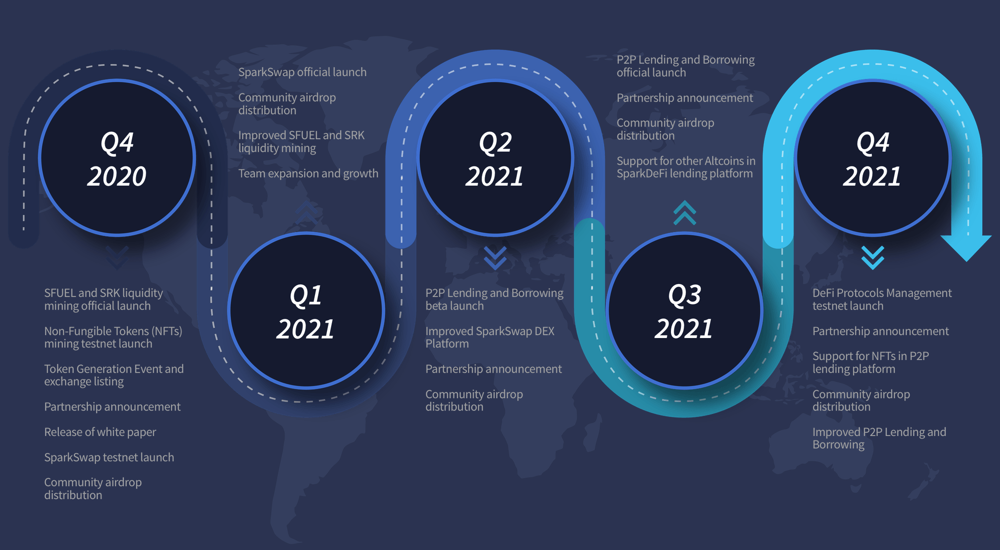

# SparkDeFi White Paper

SparkPoint Decentralized Finance platform.

## Table of Contents

* [Introduction](#introduction)
* [SparkDeFi](#sparkdefi)
  * [SparkSwap Decentralized Exchange (DEX)](#1-sparkswap-decentralized-exchange-dex)
  * [Multi-Staking](#2-multi-staking)
    * [Liquidity Staking](#a-liquidity-staking)
    * [Pool-Based Staking](#b-pool-based-staking)
  * [P2P Lending and Borrowing](#3-p2p-lending-and-borrowing)
  * [DeFi Assets Protocols Management](#4-defi-assets-protocols-management)
  * [Decentralized Governance](#5-decentralized-governance)
* [Market Opportunities](#market-opportunities)
  * 1.1 [The Rise of DeFi](#the-rise-of-defi)
  * 1.2 [The Growing Popularity of NFTs](#the-growing-popularity-of-nfts)
  * 1.3 [Decentralized Exchanges](#decentralized-exchanges)
  * 1.4 [P2P Lending and Borrowing](#p2p-lending-and-borrowing)
* Problems
  * 1.1 Lack of Interoperability
  * 1.2 Non-inclusive approach to P2P Lending
  * 1.3 Limited crypto assets as collateral
  * 1.4 Costly and inefficient credit risk and assessment
  * 1.5 Over-Collateralized Loans
* Solutions
  * 1.1 Innovative P2P Lending
  * 1.2 Microlending
* SparkDeFi Ecosystem Security and Architecture
  * Regulatory Risk or Compliance
  * Technical Issues with Smart Contracts
  * Network Security
  * SFUEL Token Economics
  * Governance Structure
* [Moving Forward](#moving-forward)
  * [Roadmap](#roadmap)
  * [Revenue Model](#revenue-model)
  * [SparkPoint Team](#sparkpoint-team)
  * [Official Support Channels](#official-support-channels)

## Introduction

Coinciding with the change in our world is also the adjustments in our daily needs. One of these is the significant system change in our financial world. Banks have been the money guardians of the people. However, the present situation of 2020 have shown us that it is possible for daily transactions to be simplified. There are now various technologies or instruments that have been developed for people to use in meeting their needs. The functions of banks as middlemen can be enhanced. How? DeFi.

### Decentralized Finance

DeFi or Decentralized Finance is the furtherance of banking. Decentralized finance (DeFi) is a type of money market that can provide you with income through interest, or you can borrow assets against collateral. These are products or services that aim to mimic the products and services that already exist in the traditional financial world. So far, DeFi's total locked value (TVL) have reached [12B USD in assets](https://blockchain.news/news/defi-12-billion-total-value-locked-ethereum-transacts-2x-bitcoin-daily). These assets are called crypto assets because they are in the form of digital tokens.

Another definition of Decentralized Finance is that it is a type of futuristic economical management system touted to levy further control to the people, without the need for financial intermediaries. Likewise, it seeks to transform the current financial management model’s intensive reliance on centralized fiscal authorities. Moreover, DeFi advocates for the creation of transparent and accessible banking tools for the inclusive and encompassing usage of those seeking to avail of financial services.

Considered by financial experts as innovative, DeFi likewise seeks to further consolidate the financial products and services offered by centralized banking authorities for the people seamlessly. Dubbed as the future of the global economy, here are some of the revolutionary concepts of our SparkDeFi platform that would, for sure, capitulate the world of finance management into new heights.

## SparkDeFi

SparkDeFi is a governance token-based DeFi platform that empowers individuals to unlock the true value of their cryptocurrency assets. The transactions that it offers are Decentralized Exchange (DEX), Multi-Staking, P2P Lending and Borrowing, and DeFi Assets Protocols Management in a seamless, transparent, secure, inclusive, and interoperable approach.

The SFUEL token is SparkDeFi’s governance token with a total supply of 150,000,000.00 (one hundred fifty million) tokens. This SFUEL will be launched as a BEP20 token on the Binance Smart Chain in Q4 of 2020. For the sake of proper structuring, the governance of SparkDeFi will be delegated to SFUEL holders. The Decentralized Autonomous Organization (DAO) members are responsible for the direction of the protocol via systematic voting.

### 1. SparkSwap Decentralized Exchange (DEX)

The company refers to this as “Spark Swap.” It is a one-stop shop “DeFi” experience. Every transaction can provide collection increase for the client through the earnings in transaction fee. There is also a fast swap of multiple cryptocurrencies in a transparent and decentralized manner.

Our own Decentralized Exchange (DEX) for a “one-stop-shop” DeFi experience. Instantly swap multiple cryptocurrencies in a trustless and decentralized manner. Earn from the transaction fees when you provide liquidity.

### 2. Multi-Staking

#### A. Liquidity Staking

Many experts viewed staking as the easiest way of earning money with cryptocurrencies. That is why it is unquestionable that its renounces' subsequent name creates a name in cryptocurrency mining and trading. It allows purchasing and permits you to hold cryptocurrency that guarantees profits and rewards.

Participants in crypto mining who were in demand of earning profits yet possess dearth in high input cost, straightway entrusted in staking. Necessarily, the changes brought by cryptocurrency was adapted and practiced in this modern world. It illustrated and exposed borderless distributions of a blockchain product. Regarding this, is the occurrence of POS or Proof of Stake coins that you can earn without having the POW or Proof of Work.

In-depth research supports the highly recommended practical and [functional profit staking](https://academy.binance.com/en/articles/what-is-yield-farming-in-decentralized-finance-defi) in the field of cryptocurrency mining and trading. What comes with money is knowledge that is priceless. For instance, in liquidity staking, we will learn a few protocols for making decentralized pre-reactive cryptocurrencies. We will also see the mechanics used when someone has or needs to raise or lower the inflation rate based on the demand rate. This protocol must be carried out because there must also be a supply to meet it when there is high demand.

Liquidity is essential for a market because large traders cannot enter the market without slippage without it. Even if we have more tokens to meet demand, it will only be not very helpful without a liquidity market. Due to the protocol's implementation, it is necessary to balance the supply and demand of the token.

#### B. Pool-Based Staking

In the platform of SparkDeFi, the client is encouraged to participate in the SRK-ETH and SFUEL-ETH liquidity staking pools and earn SRK or SFUEL, a SparkDefi governance token. By participating, the client can stake SRK tokens or SFUEL in the regular pool-based staking and collect SRK or SFUEL rewards on a regular basis.

The staking pool includes collaborative work by cryptocurrency holders whose assets were combined in order for them to increase their chances of being rewarded as well as to increase their expected ROI (Return of Investment). That is why the maximization of assets through a consistent group staking is mindedly in need because the more you stake coins on the pool, the more chances that the staking pool will be picked and let your cast get verified.

Staking pools are safe; all you need to do is a stake. It was considered profitable as mining and trading cryptocurrency. Wherein the profits you will earn will be paralleled to your investment and how long you have been engaging in Staking Pool. The more you stake, the more massive profits you can look for. It will always come with perseverance and consistency. Participate in Staking Pool in order to earn enough Staking Coins on your wallet. Do not be solely minded. It will be better to have a companion in progress.

The staking pool is managed by a Pool operator, with a chosen specific pool that might have stakeholders who desire to participate in the pool and invest their coins in a particular blockchain address or money. However, there can be an appearance of a third party. Wherein some pools require their users to participate in their staking process while regulating their personal wallet-coin consistently.

Working or staking your coins alone would not help your stake grow. If a block requests to get mine, the blockchain will find a suitable staking wallet to do it. Therefore, your staking wallet has a small number of chances to be chosen and get validated by the block. Hence, Single Staking Pool can only receive not more than 1.0% of the total Staking rewards. After splitting the rewards among participants in the pool, there are charge fees that will be counted and deducted after the final payout.

On the other hand, if you genuinely understand the staking pool and consistently take a part of it by contributing coins, there is a high chance for your staking pool to choose and get block verification. It gets a higher value than their wallets/pool. This means you are more exposed to earning and increasing your profit.

### 3. P2P Lending and Borrowing

In SparkDeFi, it is allowed to use altcoins and Non-fungible Tokens (NFTs) or cryptocollectibles such as game items, virtual estate, and digital artworks as collateral. The platform enables microlending for the purpose of democratizing finance and promoting financial inclusion. This ensures the client to consistently generate a stream of cash flow through the liquidity savings pool. Read the [The Growing Popularity of NFTs](#the-growing-popularity-of-nfts) section to learn why we're supporting NFTs.

While Decentralized Finance may have spouted a new system for finance management, DeFi also established a system of money lending and borrowing, with a ton of upside packaged into the deal.

For instance, the demand and further growth for lending services propels DeFi’s service capability, ensuring hassle-free debt systems. Additionally, the benefits DeFi provides highly out scales the current financial system’s loan service offerings.

For example, the growth of the DeFi lending-borrowing system is, in part, with the constant marking-down of technological fees. This in return makes the revolutionary debt model to be further inclusive and non-punitive to borrowers.

Substantiating the previously-raised point, the Decentralized Finance’s debt set-up typically have lower overhead costs. In comparison with the traditional system, DeFis indeed have the cost advantage. Well, this is in part with the widespread usage of tech and data, accustoming the new system to have less “brick and mortar” results; with it yielding the capability to work for lower interest returns.

Similarly, the DeFi-jointed loan-borrow structure gives greater access to capital. This is especially helpful for borrowers who aren’t credit-rated by traditional financial authorities yet. In a way, DeFi helps these Small and Medium-sized Enterprises (SMEs) to gather capital, by providing seamless and relevant methodologies.

Unlike the prevalent traditional system in place, the DeFi’s way of loaning relies on the market-driven sphere of the consumers. Operating on the dogma of transparency and market opinion, the investors of the said DeFi institutions have the final say whether a start-up business is worthy of receiving funding. In this regard, the progressive orientation of lending and borrowing outright challenges the quo of traditional institutions to provide financial aide.

### 4. DeFi Assets Protocols Management

The client of SparkDeFi can seamlessly access and connect to various DeFi projects for an end-to-end DeFi experience. Furthermore, the client can easily manage assets portfolio and collateralized debt positions (CDPs) in a simple and user-friendly dashboard.

[Bitcoin and many other digital-native assets](https://github.com/DeFinerOrg) stand out from legacy digital payment methods, such as those run by Visa and PayPal, in the remove all middlemen from transaction when you pay with a credit card for the coffee bill a financial institution sits between you and the business, with control over the transaction, retaining the authority to stop or pause it and record it in its private cut out of the price.

Applications in crypto currency or block chain technology towards disrupting financial intermediaries, deFi is the term which draws from the blockchain technology behind the digital currency yet very famous “bitcoin” deFi is distinct because it expands the use of the block chain from very simple to more complex financial use cases.

In addition, the protocol aims to introduce a novel incentive structure that promotes holding the token and providing liquidity on exchanges.

### 5. Decentralized Governance

Governance of SparkDeFi will be delegated to SFUEL holders. DAO members are responsible for the direction of the protocol via systematic voting.

## Market Opportunities

### The Rise of DeFi

Powered by lending and borrowing, derivatives, staking or yield farming etc.

### The Growing Popularity of NFTs

What is interesting about Non-Fungible Tokens (NFTs) is that it is a new breed of FinTech (Financial Technology) also seeking to transform the current state of traditional finance systems. NFTs have all the characteristics of the other cryptocurrencies, e.g. Bitcoin Etherium, Dogecoin, with one distinct feature—its unique identification. This stark attribute prevents the token to be interchanged with an identical one. This, in return, creates an effect of scarcity and digital ownership.

Likewise, the said token is ERC-721 compliant. This outlines that every token birthed by the crypto is said to be entirely unique. To exemplify, it can be likened to a one-of-a-kind collectible memorabilia.

Compared to the regular ERC-20 compliant cryptos, NFTs, with their ERC-721 compliance, could pave the way for acquiring significant assets through tokenization. Moreover, the ERC-721 label allows users to trade in market exchanges.

Just to give NFTs a little background: it all started with the rise of CryptoKitties, a blockchain game developed by Axion Zen on Ethereum. The hype developed a substantial following, and at one point, even reached a skyrocketing $100,000 for a single digital feline collectible item. However, with the recent developments, NFTs have become more than just a feline gaming currency. It has become more diverse. And with the integration of Kakao into the said crypto-token, we could only theorize what could be the future of NFTs. If anything else, the bright history of the NFT is an indication of what it could be, if it is to be further expanded in the near future.

### Decentralized Exchanges

Decentralized exchanges (DEX) poised to overtake centralized exchanges (CEX) in the coming years.

### P2P Lending and Borrowing

By 2022, the global peer-to-peer lending market is estimated to increase by almost 52% per year, reaching the US $460 billion in value. This is according to the [2017 report of Allied Market Research](https://www.alliedmarketresearch.com/peer-to-peer-lending-market).

One of the advantages of peer-to-peer or “P2P” is that its financing may be obtained from many different investors or lenders ranging from individuals to institutional investors.

The P2P is beneficial because of the low cost in technology. The platform uses such technology in a number of ways. One example is when an internet interface could be used to onboard borrowers and lenders. The algorithms could automate the assignment of credit scores, and algorithms could automate the selection and diversification of loan investments by the lenders.

The P2P lending platforms prioritize the Small and Mid-size Enterprises (SMEs) and start-ups. These businesses are traditionally served by banks, as well as consumers, to attract capital more quickly.

The post-crisis environment of low interest rates and very low or even negative yields on sovereign bonds has led investors to look for alternative investments with potentially higher yields. Loans facilitated by P2P lending platforms typically offer those higher returns, though they may come with higher risk.

The P2P lending allows individual investors to invest in, or extend P2P loans, a segment previously limited to primarily institutional investors, or to holders of lending licenses. This is what you call risk diversification.

The P2P lending can provide credit to borrowers, especially SMEs, that do not have access to bank loans. This, in effect, increases the total loans provided to the small business sector. The same lending platforms have cost advantages compared to banks. Their overhead costs are low since they leverage technology and data, and have less “brick and mortar” related costs. As a result, they can work with low interest margins.

The P2P lending platforms have provided individual investors with a new asset in the form of un-collateralised debt. Individual investors can spread small sums of money across many loans at a low cost. This is one of the features that can be obtained in the Sparkpoint.

Forwarding a new type of loan and debt system, DeFi pushes to fill the gaps of the traditional system—which is especially found in the lend-borrowing system by mainstream financial models.

## Moving Forward

### Roadmap

Our team is looking to raise funding this year to be able to focus on the development and launch of the SparkDeFi platform in 2021. SparkDefi’s various products will be launched in stages starting with the SFUEL and SRK Liquidity Mining which will launch before the end of this year.

Next is our own DEX, SparkSwap, which will launch in Q1 2021. Then our P2P Lending and Borrowing platform will launch in Q3 2021. Our fourth and final SparkDeFi product is our DeFi Protocols Management platform which has a target testnet launch of Q4 2021 and a mainnet launch in 2022.

One of the biggest main points that we’ve learned in DeFi is the cost and speed of transactions. Because of this, our team has decided to launch SparkDeFi on Binance Smart Chain to take advantage of its speed and lower cost. Our team will also benefit from Binance’s strong support of the developer community. In this regard, we’ve submitted our interest to apply for a slice of their $100M Support Fund.

### Revenue Model

SRK holders will benefit from the SparkDeFi platform because the SRK token will also be utilized in its staking, swapping, and P2P lending solutions. As early supporters of the SparkDeFi platform, SRK holders will be given priority in the private sale. They are entitled to a quarterly airdrop distribution beginning this Q4 2020. Deflationary token model.

Revenue from transactions fees.

### SparkPoint Team

* Andy Agnas, CPA - CEO
* Rico Zuñiga - CTO

### Official Support Channels

* [Website](https://srk.finance/)
* [Telegram](https://t.me/SparkDeFi)
* [Email](defi@sparkpoint.io)
* [Twitter](https://twitter.com/SparkDeFi)
* [Facebook](https://www.facebook.com/SparkDeFi)
* [Instagram](https://www.instagram.com/sparkdefi/)